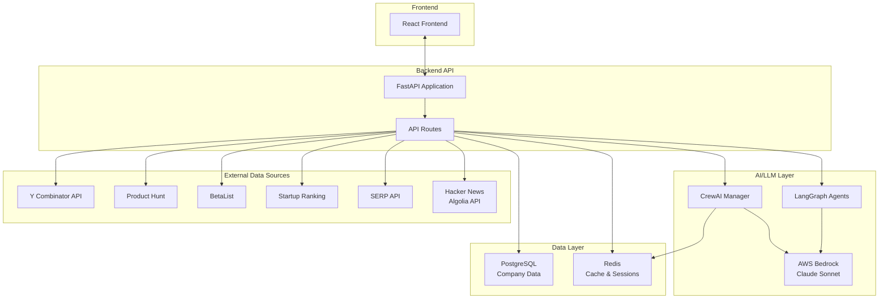
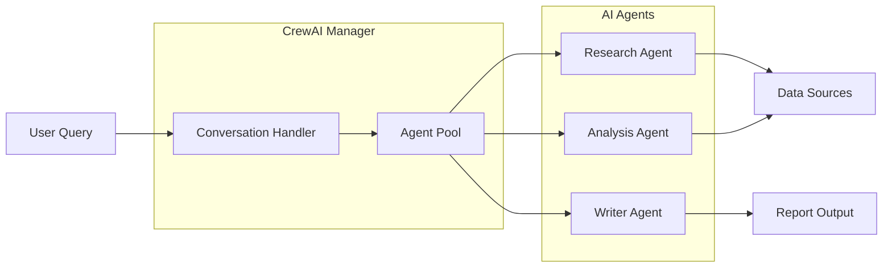
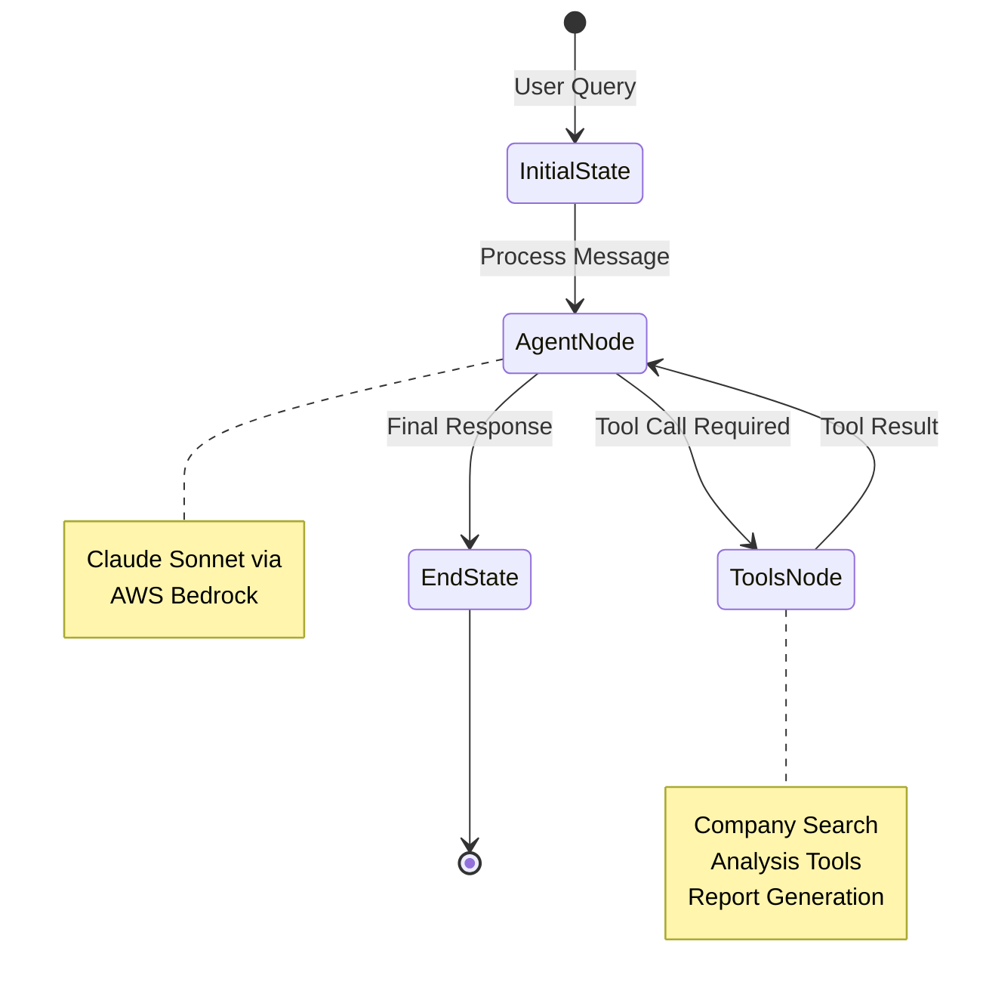
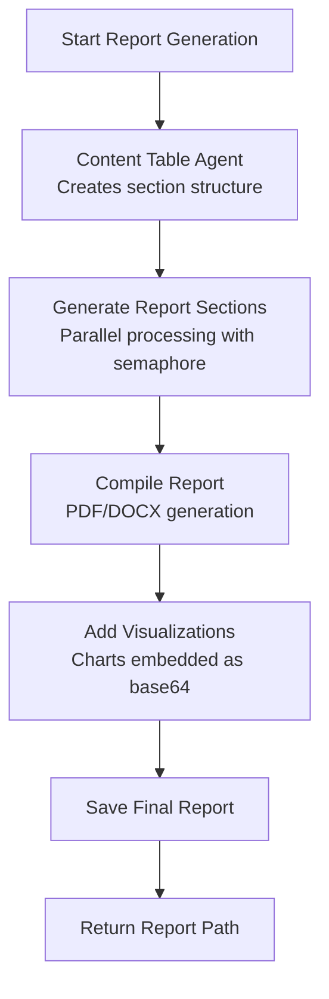
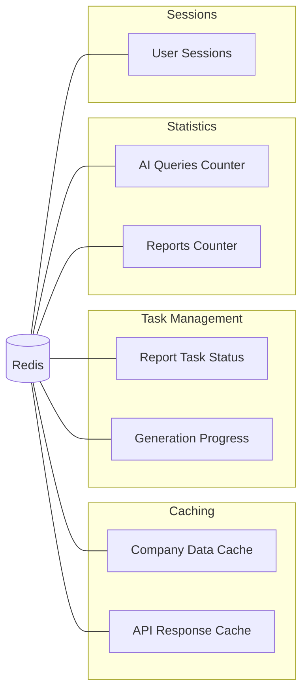
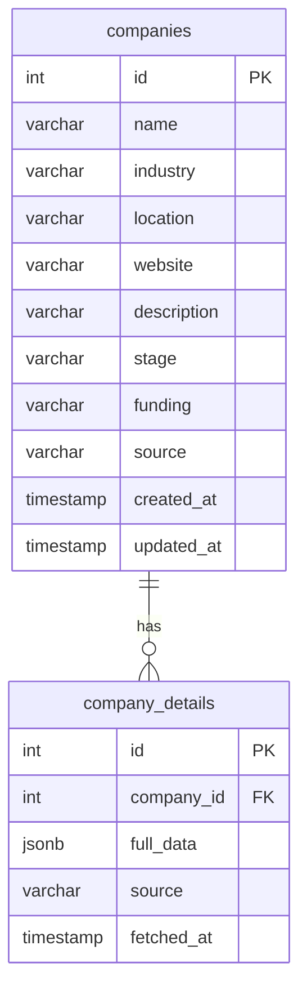
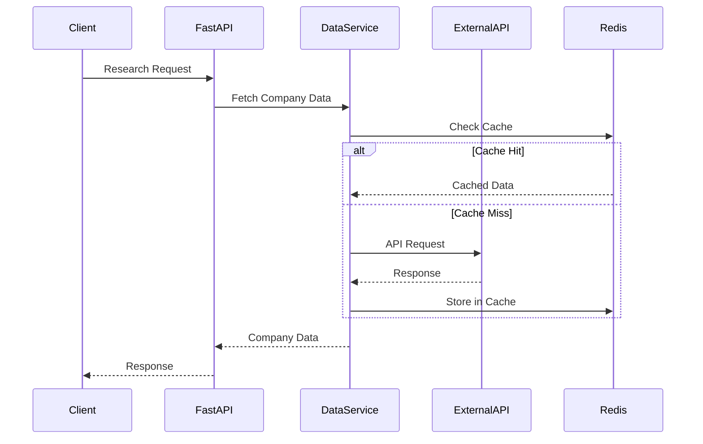
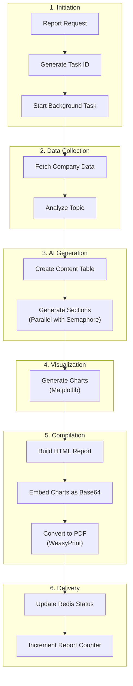
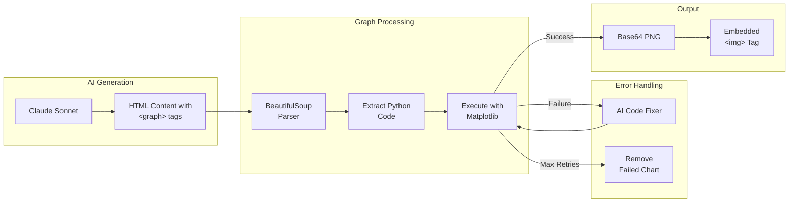

# Nexalyze Backend Architecture Documentation

## Overview

Nexalyze is an AI-powered startup research and competitive intelligence platform. This document details the backend architecture, including key technologies, data flows, and integration patterns.

## System Architecture



---

## Technology Stack

| Component | Technology | Purpose |
|-----------|------------|---------|
| **Web Framework** | FastAPI | RESTful API with async support |
| **AI Engine** | AWS Bedrock (Claude Sonnet) | LLM for chat and report generation |
| **Agent Frameworks** | CrewAI + LangGraph | Multi-agent orchestration |
| **Primary Database** | PostgreSQL | Company data storage |
| **Cache/Sessions** | Redis | Caching, task status, session management |
| **PDF Generation** | WeasyPrint | HTML to PDF conversion |
| **Data Visualization** | Matplotlib, Seaborn | Chart generation |

---

## Data Sources

Nexalyze integrates with **6 primary data sources** to provide comprehensive startup intelligence:

### 1. Y Combinator (YC)
- **API**: YC Open API (`api.ycombinator.com/v0.1`)
- **Data**: YC-backed companies, batch info, industry classification
- **Implementation**: `services/external_data_service.py` → `get_yc_companies()`
- **Caching**: 1-hour TTL in-memory cache

### 2. Product Hunt
- **Method**: Web scraping
- **URL**: `producthunt.com`
- **Data**: New product launches, trending products, taglines
- **Implementation**: `services/scraper_service.py` → `scrape_product_hunt()`

### 3. BetaList
- **Method**: Web scraping
- **URL**: `betalist.com/startups`
- **Data**: Early-stage startups, beta products
- **Implementation**: `services/scraper_service.py` → `scrape_betalist()`

### 4. Startup Ranking
- **Method**: Web scraping
- **Data**: Startup rankings, metrics, comparisons
- **Implementation**: `services/scraper_service.py` → `scrape_startup_ranking()`

### 5. SERP API (Google Search)
- **API**: SerpAPI (`serpapi.com`)
- **Data**: Knowledge graphs, organic results, news, related searches
- **Implementation**: `services/external_data_service.py` → `serp_search()`, `serp_company_info()`
- **Features**: Company funding, competitors, recent news

### 6. Hacker News
- **API**: Hacker News Algolia API (`hn.algolia.com/api/v1`)
- **Data**: Tech news mentions, community discussions, points, comments
- **Implementation**: `services/external_data_service.py` → `get_hacker_news_mentions()`
- **Caching**: 1-hour TTL

---

## CrewAI Integration

CrewAI is used for multi-agent orchestration in complex analysis tasks.

### Architecture



### Key Components

| File | Purpose |
|------|---------|
| `services/crew_manager.py` | Central CrewAI orchestration |
| `agents/crew_agents.py` | Agent definitions and configurations |
| `tasks/crew_tasks.py` | Task templates for agents |

### Workflow

1. **User initiates request** → CrewManager receives query
2. **Agent selection** → Appropriate agents activated based on task type
3. **Parallel execution** → Agents work concurrently with rate limiting
4. **Result aggregation** → Outputs combined into final response

---

## LangGraph Agent System

LangGraph provides a graph-based approach for conversational AI and report generation.

### Conversational Agent Flow



### Report Generation Agent Flow



### Key Files

| File | Purpose |
|------|---------|
| `agents/langgraph_agent/graph.py` | Conversational agent graph definition |
| `agents/langgraph_agent/nodes.py` | Node functions (agent, tools) |
| `agents/langgraph_agent/tools.py` | Tool definitions (search, analyze, generate) |
| `agents/report_agent/graph.py` | Report generation graph |
| `agents/report_agent/nodes.py` | Report section generation nodes |

### Agent State Management

```python
class ConversationalAgentState(TypedDict):
    messages: List[BaseMessage]
    session_id: str
    user_query: str
    context: Dict[str, Any]
    tools_used: List[str]
    iteration_count: int
```

---

## Redis Usage

Redis serves multiple purposes in the Nexalyze architecture:

### Use Cases



### Key Patterns

| Pattern | Key Format | TTL | Purpose |
|---------|-----------|-----|---------|
| Task Status | `task:report:{task_id}` | 24 hours | Track report generation status |
| Stats Counter | `stats:total_queries` | Permanent | AI query count |
| Stats Counter | `stats:total_reports` | Permanent | Report count |
| Cache | `{source}:{query_hash}` | 1 hour | API response caching |

### Implementation

```python
# Example: Incrementing stats counters
redis_conn.incr("stats:total_queries")

# Example: Task status update
redis_conn.set(f"task:report:{task_id}", {
    "status": "processing",
    "progress": 50,
    "message": "Generating sections..."
}, expire=3600)
```

---

## PostgreSQL Usage

PostgreSQL stores persistent company data and analysis results.

### Schema Overview



### Connection Management

- **Connection Pool**: Managed via `database/connections.py`
- **Retry Logic**: Automatic reconnection on failure
- **Query Patterns**: Async queries via connection pool

### Key Operations

| Operation | Function | Description |
|-----------|----------|-------------|
| Search Companies | `search_companies(query)` | Full-text search |
| Get Company Count | `SELECT COUNT(*)` | Stats endpoint |
| Store Company | `store_company(data)` | Data ingestion |

---

## External API Integration

### API Request Flow



### Rate Limiting

All external API calls implement rate limiting:

```python
async def _rate_limit(self, source: str, delay: float = 1.0):
    """Apply rate limiting per source"""
    last_request = self.rate_limiters.get(source, 0)
    elapsed = time.time() - last_request
    if elapsed < delay:
        await asyncio.sleep(delay - elapsed)
    self.rate_limiters[source] = time.time()
```

### Error Handling

- **Graceful Degradation**: Failed sources don't block entire request
- **Fallback Data**: Cached data used when APIs unavailable
- **Logging**: All errors logged with source context

---

## Report Generation Pipeline

### Complete Flow



### Parallel Processing

Report sections are generated in parallel with concurrency control:

```python
# Create a semaphore to limit concurrency to 5
sem = asyncio.Semaphore(5)

async def _process_section(section):
    async with sem:
        # Generate section content via LLM
        ...

# Process all sections in parallel
tasks = [_process_section(section) for section in content_table.sections]
results = await asyncio.gather(*tasks)
```

---

## Dynamic Visualization System

Nexalyze includes a dynamic chart generation system that allows AI to create visualizations inline within reports.

### Graph Tag Processing Flow



### How It Works

1. **AI generates report sections** with embedded `<graph>` tags containing Python matplotlib code
2. **Graph processor** parses HTML and extracts code from `<graph>` tags
3. **Code execution** runs the Python code in a sandboxed environment
4. **Image capture** saves the matplotlib figure as a base64 PNG
5. **Tag replacement** replaces `<graph>` tags with `` tags containing embedded images

### Example Graph Tag

```html
<graph>
import matplotlib.pyplot as plt
import numpy as np

categories = ['Technology', 'Healthcare', 'Finance', 'Retail']
values = [35, 25, 20, 20]
colors = ['#667eea', '#764ba2', '#f093fb', '#f5576c']

fig, ax = plt.subplots(figsize=(10, 6))
ax.pie(values, labels=categories, autopct='%1.1f%%', colors=colors)
ax.set_title('Market Distribution by Sector', fontweight='bold')
plt.tight_layout()
</graph>
```

### Key Files

| File | Purpose |
|------|---------|
| `services/graph_utils.py` | Graph tag processing and code execution |
| `agents/report_agent/nodes.py` | Prompts for generating graph tags |
| `services/report_service.py` | Integration with report compilation |

### AI-Powered Error Fixing

If graph code fails to execute, the system:

1. Captures the error message and traceback
2. Sends failed code to Claude Sonnet for correction
3. Retries execution with fixed code (up to 2 attempts)
4. Gracefully removes chart if all attempts fail

```python
async def fix_graph_code(failed_code: str, error_message: str) -> Optional[str]:
    """Use AI to fix failed graph code"""
    fix_prompt = f"""Fix this matplotlib code that failed:
    
Code: {failed_code}
Error: {error_message}

Return only corrected Python code."""
    
    response = await bedrock_service.generate_text(fix_prompt)
    return extract_code_from_response(response)
```

---

## API Endpoints

### Key Endpoints

| Endpoint | Method | Description |
|----------|--------|-------------|
| `/api/v1/stats` | GET | System statistics (companies, queries, reports) |
| `/api/v1/chat` | POST | AI chat with streaming response |
| `/api/v1/generate-comprehensive-report-background` | POST | Start report generation |
| `/api/v1/task-status/{task_id}` | GET | Check report generation status |
| `/api/v1/companies/search` | GET | Search companies |
| `/api/v1/companies/{company_id}` | GET | Get company details |

### Streaming Response (Chat)

```python
@router.post("/chat")
async def chat_interface(request: ResearchRequest):
    async def generate_chat_stream():
        # Stream SSE events
        yield f"data: {json.dumps({'type': 'start', ...})}\n\n"
        # ... stream content in chunks
        yield f"data: {json.dumps({'type': 'complete', ...})}\n\n"
    
    return StreamingResponse(
        generate_chat_stream(),
        media_type="text/event-stream"
    )
```

---

## Directory Structure

```
backend/
├── agents/
│   ├── langgraph_agent/     # Conversational AI agent
│   │   ├── graph.py         # Agent graph definition
│   │   ├── nodes.py         # Node implementations
│   │   ├── tools.py         # Tool functions
│   │   └── state.py         # State schema
│   └── report_agent/        # Report generation agent
│       ├── graph.py
│       ├── nodes.py
│       └── state.py
├── api/
│   └── routes.py            # API endpoint definitions
├── config/
│   └── settings.py          # Configuration management
├── database/
│   └── connections.py       # DB connection management
├── docs/                    # Documentation
├── services/
│   ├── bedrock_service.py   # AWS Bedrock integration
│   ├── crew_manager.py      # CrewAI orchestration
│   ├── data_service.py      # Data operations
│   ├── external_data_service.py  # External API integrations
│   ├── graph_utils.py       # Dynamic chart generation from graph tags
│   ├── report_service.py    # Report generation
│   ├── research_service.py  # Research workflows
│   └── scraper_service.py   # Web scraping
├── reports/                 # Generated reports (PDF)
├── charts/                  # Generated charts (PNG)
├── main.py                  # Application entry point
└── requirements.txt         # Dependencies
```

---

## Environment Variables

| Variable | Description | Required |
|----------|-------------|----------|
| `DATABASE_URL` | PostgreSQL connection string | Yes |
| `REDIS_URL` | Redis connection string | Yes |
| `AWS_ACCESS_KEY_ID` | AWS credentials | Yes |
| `AWS_SECRET_ACCESS_KEY` | AWS credentials | Yes |
| `AWS_REGION` | AWS region (default: us-east-1) | Yes |
| `SERP_API_KEY` | SerpAPI key for search | Optional |
| `NEWS_API_KEY` | NewsAPI key | Optional |
| `GITHUB_TOKEN` | GitHub API token | Optional |

---

## Performance Considerations

1. **Caching**: All external API responses cached (1-hour TTL)
2. **Connection Pooling**: PostgreSQL and Redis use connection pools
3. **Async Operations**: All I/O operations are async
4. **Rate Limiting**: External API calls rate-limited per source
5. **Parallel Processing**: Report sections generated in parallel (max 5 concurrent)
6. **Streaming Responses**: Chat uses SSE for real-time streaming

---

## Monitoring & Logging

- **Logging**: Python `logging` module with configurable levels
- **Task Tracking**: Redis-based task status with progress updates
- **Statistics**: Real-time counters for queries and reports
- **Error Handling**: Comprehensive try/catch with fallback behavior
